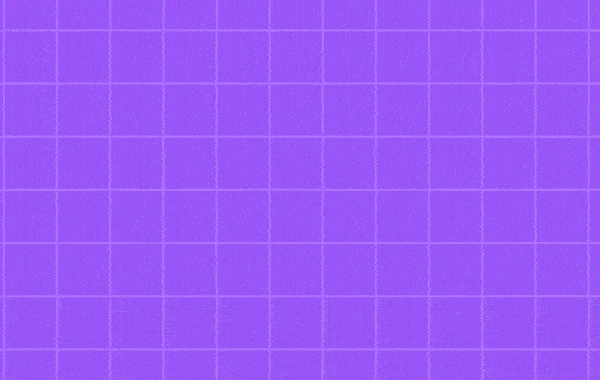

# NLW Pocket - Rocketseat

No mês de setembro de 2024 a Rocketseat promoveu o NLW Pocket. Neste evento foi feita uma aplicação chamada inOrbit, uma aplicação para gerenciamento de metas gamificada. A aplicação possui um backend feito em Node e o seu frontend foi feito em React.

Neste repositório o backend e o frontend estão em pastas em separado. Cada uma destas pastas tem um arquivo README com as anotações feitas em aulas e instruções para instalar o projeto.

Tecnologias utilizadas:

- Javascript
- React
- Node.js
- Fastify
- Zod
- Drizzle
- Vite
- TailwindCSS
- React Query
