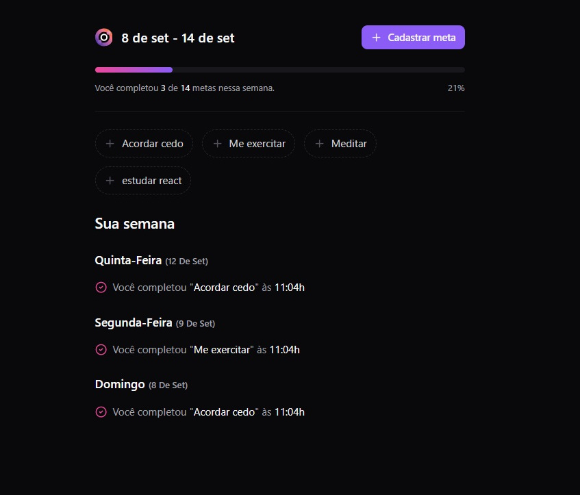
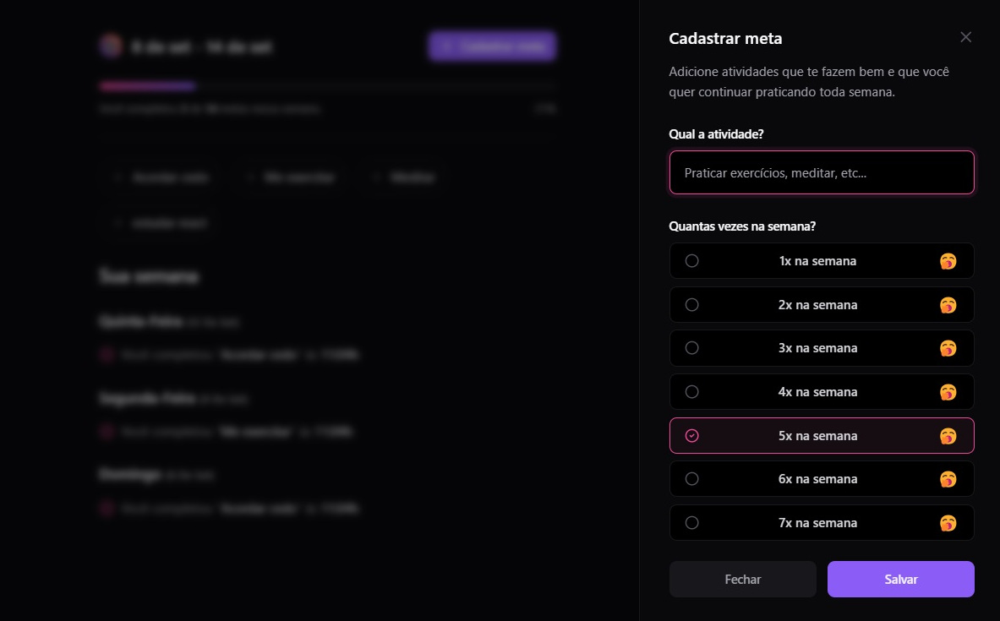

# INORBIT - Frontend

O frontend do projeto inOrbit foi feito utilizando React.

Para criar o projeto foi utilizado o seguinte comando dentro da pasta que vai guardar a aplicação:

```npm create vite@latest```

Foi criado um projeto Web utilizando React com Typescript.

Logo após a criação do projeto devem ser instaladas as dependencias utilizando o seguinte comando:

```npm install```

Para rodar a aplicação utilizar o seguinte comando:

```npm run dev```





## Dependências utilizadas na aplicação

A parte de estilização CSS foi feita utilizando o TailwindCSS.

https://tailwindcss.com/docs/installation

Guia de instalação para o Vite
https://tailwindcss.com/docs/guides/vite

Para instalar:

```npm install -D tailwindcss postcss autoprefixer```
```npx tailwindcss init -p```

Para quem utiliza o editor de código VScode é recomendado instalar a extensão do Tailwind

Para consumir os dados da API vamos utilizar o TanStack Query (React Query)
https://tanstack.com/query/latest

Para instalar:

```npm install @tanstack/react-query```

## Estrutura da aplicação:

O codigo da aplicação fica dentro da pasta src. Dentro dela existem as seguintes pastas:

* assets
* components
* http


***main.tsx***

Inicia a aplicação. Ela utiliza o react-query como provider para consumir os dados da API. Dentro do provider é inserido o componente como a lógida da aplicação

```
import './index.css'

import { StrictMode } from 'react'
import { createRoot } from 'react-dom/client'
import { App } from './app'
import { QueryClient, QueryClientProvider } from '@tanstack/react-query'
import { Toaster } from 'sonner'

const queryClient = new QueryClient()

createRoot(document.getElementById('root')!).render(
  <StrictMode>
    <QueryClientProvider client={queryClient}>
      <App />

      <Toaster position="bottom-left" richColors />
    </QueryClientProvider>
  </StrictMode>
)

```


***app.tsx***

Na aplicação sempre é exibido o componente CreateGoal. Se houverem dados cadastrados é exibido o componente WeeklySummary, caso contrário é exibido o componente EmptyGoals.

```
import { Dialog } from '@radix-ui/react-dialog'
import { CreateGoal } from './components/create-goal'
import { WeeklySummary } from './components/weekly-summary'
import { useQuery } from '@tanstack/react-query'
import { getSummary } from './http/get-summary'
import { Loader2 } from 'lucide-react'
import { EmptyGoals } from './components/empty-goals'

export function App() {
  const { data, isLoading } = useQuery({
    queryKey: ['summary'],
    queryFn: getSummary,
  })

  if (isLoading || !data) {
    return (
      <div className="h-screen flex items-center justify-center">
        <Loader2 className="text-zinc-500 animate-spin size-10" />
      </div>
    )
  }

  return (
    <Dialog>
      {data.summary.total > 0 ? (
        <WeeklySummary summary={data.summary} />
      ) : (
        <EmptyGoals />
      )}

      <CreateGoal />
    </Dialog>
  )
}
```

***Pasta assets***
Possui as imagens svg utilizadas na aplicação.

***Pasta http***

Dentro da pasta http ficam as chamadas para a API. Elas são feitas utilizando o React Query. Exemplo de uma chamada http para enviar dados da API através do método ***POST***.

```
export interface CreateGoalRequest {
  title: string
  desiredWeeklyFrequency: number
}

export async function createGoal({
  title,
  desiredWeeklyFrequency,
}: CreateGoalRequest): Promise<void> {
  const response = await fetch('http://localhost:3333/goals', {
    method: 'POST',
    headers: {
      'Content-Type': 'application/json',
    },
    body: JSON.stringify({
      title,
      desiredWeeklyFrequency,
    }),
  })

  if (!response.ok) {
    throw new Error('Error while creating the goal')
  }
}
```

Exemplo de uma chamada http para receber dados da API através do método ***GET***.

```
export interface GetSummaryResponse {
  summary: {
    completed: number
    total: number
    goalsPerDay: Record<
      string,
      {
        id: string
        title: string
        createdAt: string
      }[]
    >
  }
}

export async function getSummary(): Promise<GetSummaryResponse> {
  const response = await fetch('http://localhost:3333/summary')
  const data = await response.json()

  return data
}
```

Tanto para o envio quanto para o recebimento foi utilizado uma interface para definir a estrutura de envio e recebimento de dados. A conexão com a API utliza fecth, que é nativo do JavaScript.

***Pasta components***

Ela possui as telas da aplicação e os componentes que são reutilizados pelas diversas telas. Dentro da pasta UI existem os componentes padrão disponibilizados pelo evento.

Os componentes referentes as telas da aplicação são estes:

***create-goal.tsx***
***empty-goals.tsx***
***in-orbit-icon.tsx***
***pending-goals.tsx***
***weekly-summary.tsx***

Exemplo da estrutura de um componente:

```
import { Plus } from 'lucide-react'
import { OutlineButton } from './ui/outline-button'
import { useQuery, useQueryClient } from '@tanstack/react-query'
import { getPendingGoals } from '../http/get-pending-goals'
import { createGoalCompletion } from '../http/create-goal-completion'

export function PendingGoals() {
  const queryClient = useQueryClient()

  const { data, isLoading } = useQuery({
    queryKey: ['pending-goals'],
    queryFn: getPendingGoals,
  })

  if (isLoading || !data) {
    return null
  }

  async function handleCreateGoalCompletion(goalId: string) {
    await createGoalCompletion({ goalId })

    queryClient.invalidateQueries({ queryKey: ['pending-goals'] })
    queryClient.invalidateQueries({ queryKey: ['summary'] })
  }

  return (
    <div className="flex flex-wrap gap-3">
      {data.pendingGoals.map(goal => {
        return (
          <OutlineButton
            key={goal.id}
            onClick={() => handleCreateGoalCompletion(goal.id)}
            disabled={goal.completionCount >= goal.desiredWeeklyFrequency}
          >
            <Plus className="size-4 text-zinc-600" />
            {goal.title}
          </OutlineButton>
        )
      })}
    </div>
  )
}
```

Neste componente foram importados os componentes visuais da pasta UI e foi importado o arquivo da pasta http responsável por consumir os dados da API.

Para o consumo dos dados da API foi utilizado o ***React Query***. Exemplo de utilização:

```
import { useQuery, useQueryClient } from '@tanstack/react-query'
import { getPendingGoals } from '../http/get-pending-goals'

  const { data, isLoading } = useQuery({
    queryKey: ['pending-goals'],
    queryFn: getPendingGoals,
  })
```

O hook ***useQuery*** recebe dois parâmetros, o primeiro é o queryKey, que é um identificador desta consulta. O segundo é o queryFn, que é uma função que vai se conectar na API utilizando fetch. O retorno deve ser guardado na variável data, que poderá ser utilizada em qualquer lugar do componente.


